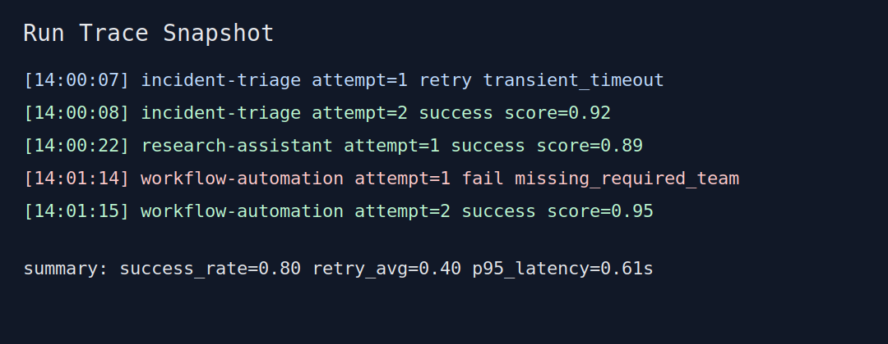

# Agent Demo Pack

This repository now includes a `demo/` package designed to quickly demonstrate credibility and reproducibility for an agent system.

## Included Use Cases
- **Incident triage assistant** (`demo/use_cases/incident-triage.md`)
- **Research assistant** (`demo/use_cases/research-assistant.md`)
- **Workflow automation** (`demo/use_cases/workflow-automation.md`)

Each use case includes:
- reproducible input prompt,
- expected output (golden behavior),
- weighted evaluation criteria.

## Benchmark Script
Run:

```bash
python demo/benchmark.py --runs 10 --seed 7
```

The script writes `demo/traces/benchmark-report.json` and prints metrics for:
- latency (avg + p95),
- success rate,
- retry count.

## Run Trace Evidence
### Screenshot-style trace snapshot


### Log snippet
```text
2026-03-01T14:00:07Z request_id=inc-2041 case=incident-triage attempt=1 status=retry reason=transient_timeout latency_ms=402
2026-03-01T14:00:08Z request_id=inc-2041 case=incident-triage attempt=2 status=success score=0.92 latency_ms=611
2026-03-01T14:00:22Z request_id=res-9913 case=research-assistant attempt=1 status=success score=0.89 latency_ms=318
2026-03-01T14:01:14Z request_id=wfa-1188 case=workflow-automation attempt=1 status=fail reason=missing_required_team:data-platform latency_ms=279
2026-03-01T14:01:15Z request_id=wfa-1188 case=workflow-automation attempt=2 status=success score=0.95 latency_ms=341
```

(Full sample trace: `demo/traces/run-trace.log`)

## Additional Documentation
- `docs/architecture.md`: system design, trade-offs, and scaling strategy.
- `docs/postmortem.md`: failure case and self-correction flow.
